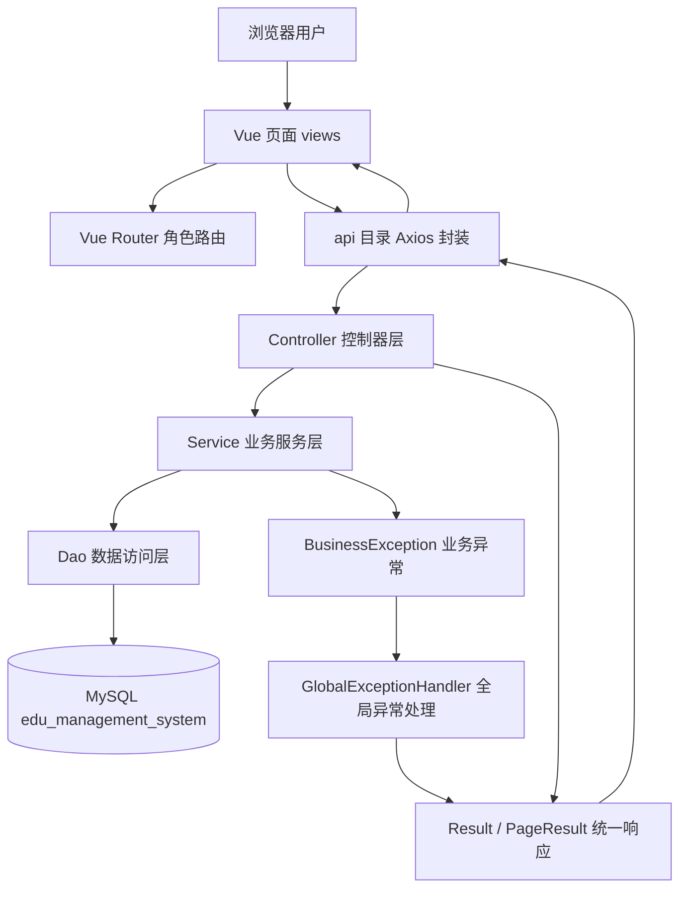
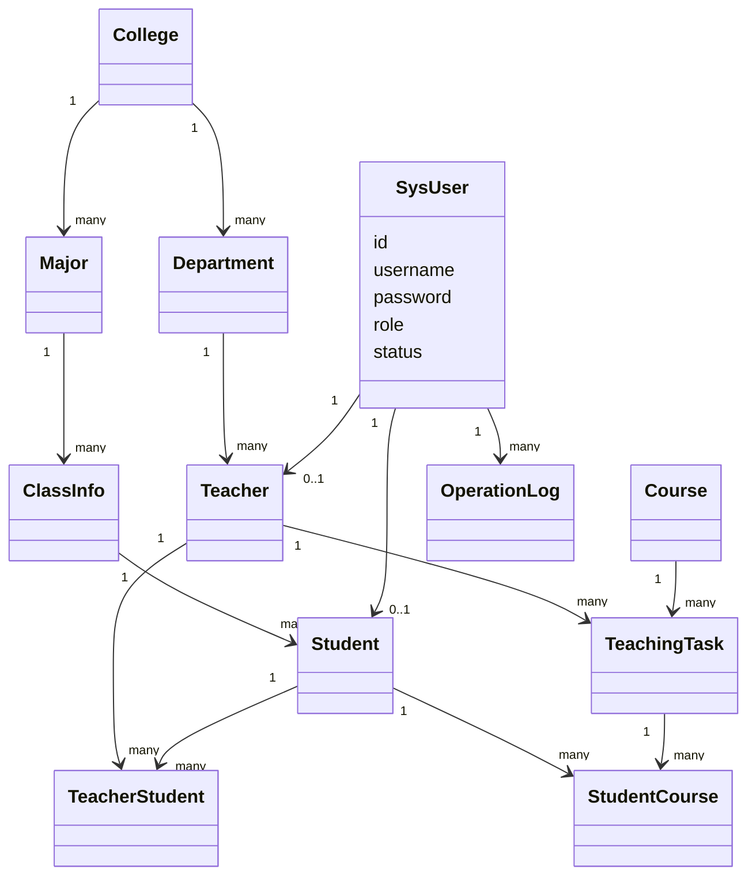
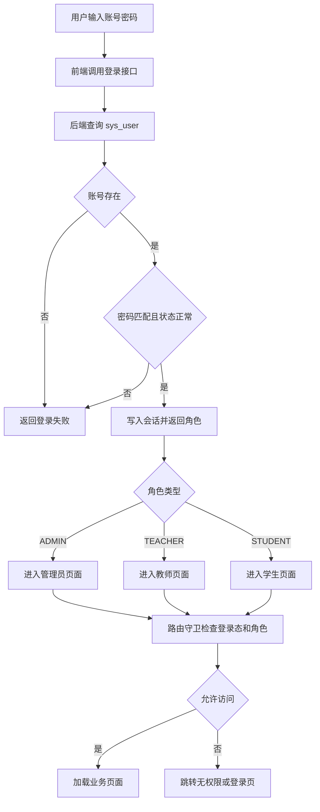
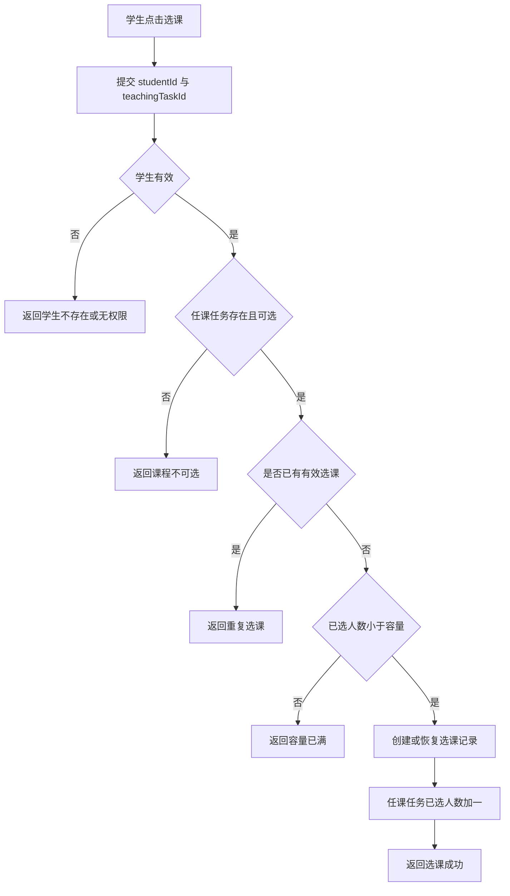
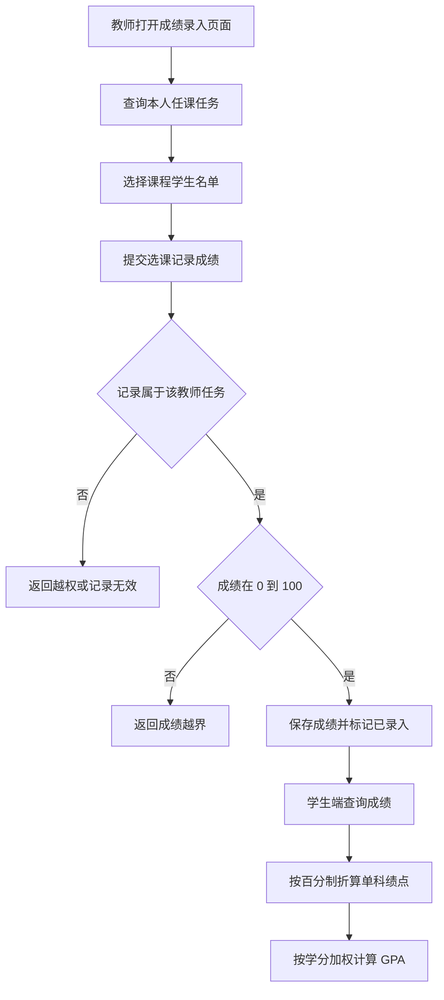
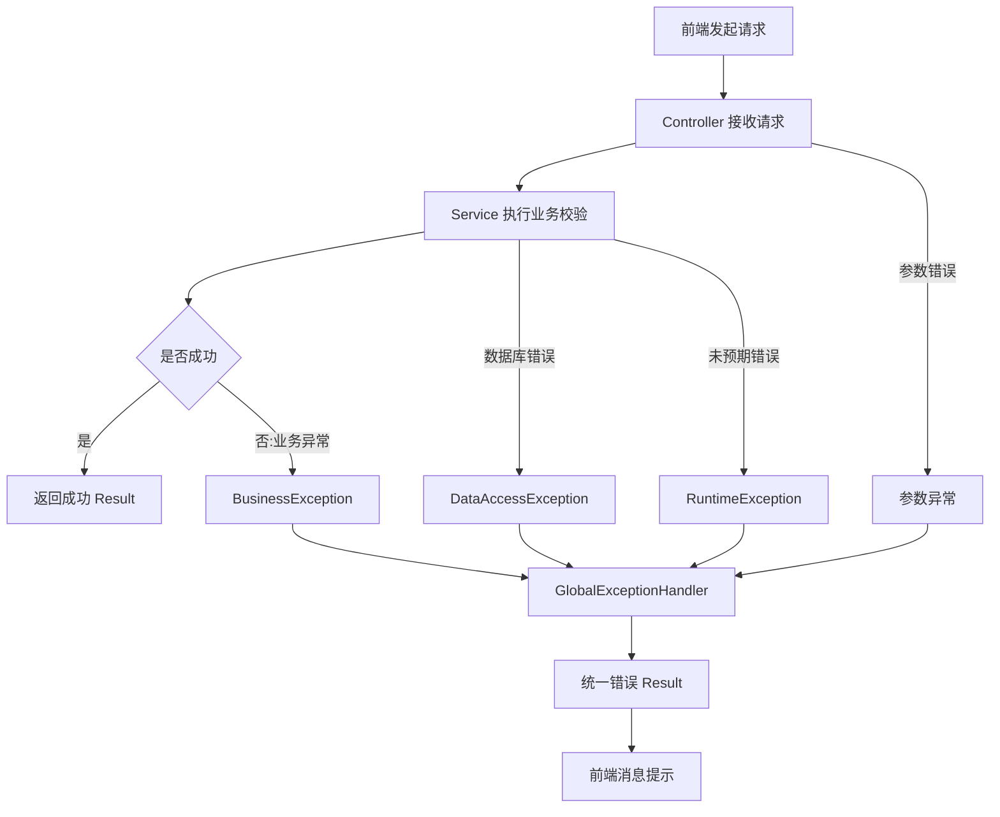

# 第 3 章 程序框图（或类图，或算法原理）

本章采用 Mermaid 绘制系统结构图、实体类图和核心业务流程图。图形用于说明模块之间的职责边界、调用关系、实体联系和关键算法步骤，不展示任何源代码。图中的类名和模块名以当前项目实际结构为依据，同时对课程设计目录中提到的理想组件作适当映射说明。

## 3.1 系统全局包结构与 MVC 调用关系框图

系统后端整体位于 `com.tzufucius.edu.edumanagementsystem` 包下，按职责划分为控制器、服务、数据访问、实体、数据传输、通用返回和异常处理等部分。前端位于 `frontend/src` 下，按页面、接口封装、路由、布局和工具函数组织。MVC 调用关系可以理解为浏览器页面首先触发 Vue 组件事件，组件通过 API 封装调用 Axios，请求进入 Spring Boot Controller；Controller 不直接处理复杂业务，而是调用 Service；Service 根据业务规则调用 Dao；Dao 使用 JdbcTemplate 访问 MySQL；数据库返回结果后再逐层回传，最终由前端页面渲染为表格、表单或图表。该关系体现了前后端分离和后端分层的共同设计。

当前项目中，基础模块如学院、专业、教研室、班级、课程具有较典型的 Controller-Service-Dao-Entity 链路；综合业务如用户、学生、教师、任课任务、选课成绩和报表，由 `AcademicBusinessService` 与 `AcademicBusinessDao` 集中承载一部分跨表业务。统一返回通过 `Result` 表示，日志分页通过 `PageResult` 表示，异常由 `GlobalExceptionHandler` 兜底。图中并不表示每一个具体方法，而是抽象出层间方向：前端只能调用控制器，控制器只能依赖服务，服务协调数据访问和业务校验，数据访问层才与数据库交互。这种约束可以减少跨层调用，使程序结构便于维护、测试和课程报告说明。

## 3.2 系统核心实体类图（UML Class Diagram）

系统核心实体围绕组织结构、人员、课程和业务记录展开。学院与专业是一对多关系，专业与班级是一对多关系，班级与学生是一对多关系；学院与教研室是一对多关系，教研室与教师是一对多关系；教师和课程之间不是直接多对多，而是通过任课任务连接；学生和任课任务之间也不是直接多对多，而是通过学生选课成绩记录连接。这样设计可以把不同学期、不同教师、不同容量、不同教室的开课情况与抽象课程区分开，也可以把成绩放在“学生选择了某个具体任课任务”这一关系上，而不是放在学生表或课程表中。

类图中的 `SysUser` 代表登录身份，与学生或教师通过一对一关系绑定。`TeachingTask` 是课程运行的中心实体，既关联教师，也关联课程，并保存学期、时间、地点、容量、已选人数和任务状态。`StudentCourse` 是选课与成绩实体，保存学生、任课任务、选课时间、成绩、成绩状态和选课状态。`TeacherStudent` 表示教师指导学生关系，适合课程设计要求中的教师指导学生业务。`OperationLog` 不参与教务主链路，但与用户关联，用于记录关键操作。当前后端实体类文件只显式建立了部分基础实体，综合业务多以映射结果返回；但数据库逻辑结构已经完整表达这些实体关系，因此报告类图以数据库实体模型为准。

## 3.3 登录与角色权限拦截流程图

登录流程从用户提交账号密码开始。前端登录页负责收集输入并调用认证接口，后端根据账号查询用户记录，依次判断账号是否存在、密码是否正确、状态是否正常。若任一条件不满足，则返回统一失败结果，前端给出消息提示；若校验通过，后端生成会话登录信息并返回用户角色。前端根据角色决定跳转目标页面，例如管理员进入后台总览，教师进入教师工作台，学生进入学生工作台。后续访问页面时，前端路由守卫首先检查是否存在登录用户信息，再根据角色检查是否允许进入目标路由。

当前项目没有单独落地后端 `AuthInterceptor` 与 `WebConfig` 权限拦截类，因此图中的“权限拦截”应理解为当前实现与后续设计的结合：现阶段由 `AuthController`、会话信息、前端路由守卫和业务接口参数共同完成基础控制；后续可以把未登录拦截和角色校验迁移到后端拦截器中统一执行。流程设计的重点是明确正常路径和异常路径。未登录用户访问受保护页面时，应被引导回登录页；角色不匹配时，应进入无权限提示页面；登录成功后，系统不应让学生看到管理员菜单，也不应让教师进入非本人业务数据范围。该流程既满足课程设计的三角色要求，也为后续 RBAC 扩展保留了入口。

## 3.4 学生在线选课容量判定流程图

学生在线选课容量判定流程以“学生选择某一任课任务”为起点。前端提交学生编号和任课任务编号，后端首先确认学生记录有效，再确认任课任务存在且处于可选状态。随后系统检查该学生是否已经选择过同一任务，如果已有有效选课记录，则返回重复选课提示；如果曾经退课，可根据设计选择重新激活原记录或重新建立记录。接着系统读取任课任务容量和已选人数，若已选人数达到容量上限，则返回容量已满；若仍有剩余名额，则创建或恢复选课记录，并同步增加已选人数。

该流程的关键是把“容量判断”和“选课记录写入”放在同一业务事务语义中理解。即使课程设计阶段未引入复杂并发控制，也应在报告中说明容量字段和已选字段必须保持一致，不能只新增选课记录而不更新已选人数，也不能只更新人数而不保存学生选课记录。数据库层面的唯一约束负责防止同一学生重复选择同一任务，状态字段负责区分已选和已退。若后续部署到真实高并发环境，还需要通过数据库行锁、乐观锁、Redis 原子计数或分布式锁进一步保证并发容量准确性。当前流程适合课程设计演示和单机测试，可覆盖正常选课、重复选课、容量不足、任务停用、学生不存在等典型情况。

## 3.5 教师成绩录入合规校验与 GPA 折算逻辑

教师成绩录入流程从教师选择本人任课课程开始。系统应先确认教师身份与任课任务关系，确保教师只能录入自己课程下学生的成绩。进入学生名单后，教师提交某条选课记录的成绩，后端判断选课记录是否存在、是否属于该教师任课任务、分数是否为空或是否在 0 到 100 范围内。若校验失败，返回成绩越界或记录不合法提示；若校验通过，则更新 `student_course` 中的分数和成绩状态。学生端查询成绩时，系统读取已录入成绩、课程学分和课程信息，并根据折算规则计算绩点、已获学分和加权 GPA。

GPA 折算逻辑应与百分制成绩分离。百分制成绩是数据库保存的原始评价，绩点是展示和统计时根据规则转换得到的结果。课程设计可采用简化规则：90 分及以上对应优秀绩点，80 到 89 分对应良好绩点，70 到 79 分对应中等绩点，60 到 69 分对应及格绩点，低于 60 分不获得学分。综合 GPA 应按课程学分加权，即单门课程绩点乘以学分后求和，再除以已录入课程的学分总和。该流程需要说明当前项目成绩录入由 `StudentCourseController` 及综合业务服务承担，而不是独立的 `GradeController`。这样写既符合目录要求，又不夸大当前代码结构。

## 3.6 统一异常处理流程图

统一异常处理流程用于保证无论错误来自业务规则、请求参数、数据库约束还是系统运行时，前端都能收到稳定格式的响应。正常情况下，Controller 调用 Service 成功后返回 `Result.success` 类语义结果；当 Service 发现业务条件不满足时，生成业务异常，例如重复选课、课程容量已满、成绩越界或记录不存在；当请求体无法解析、参数类型错误或必填字段缺失时，由参数异常路径处理；当数据库出现唯一约束冲突、外键限制或连接问题时，由数据访问异常路径处理；其他未预期异常由运行时兜底路径处理。所有异常最终都转换为统一 `Result`，并记录必要日志。

该流程的意义在于隔离用户提示和系统细节。用户不需要看到数据库错误语句、异常堆栈或后端类名，而应看到“课程容量已满”“成绩必须在 0 到 100 之间”“无权限访问”等业务化提示。开发者则可以通过日志文件和请求标识追踪问题。当前项目 `GlobalExceptionHandler` 已承担全局异常归一化职责，`BusinessException` 用于表达业务错误，`Result` 用于统一响应结构。前端 Axios 和 Element Plus 消息提示构成用户侧反馈机制。报告中应强调异常处理不是附加功能，而是系统健壮性的重要组成部分，尤其在教务系统中，错误数据可能影响选课人数、成绩统计和权限边界，因此必须在正常流程之外明确异常流程。

